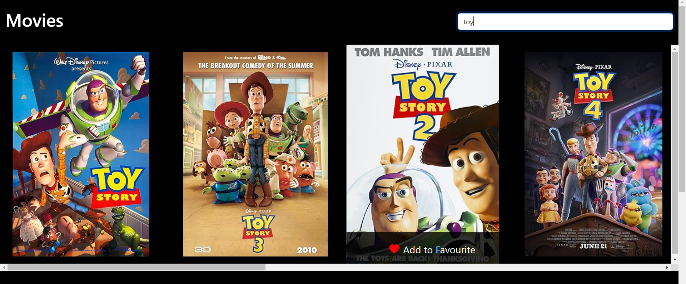
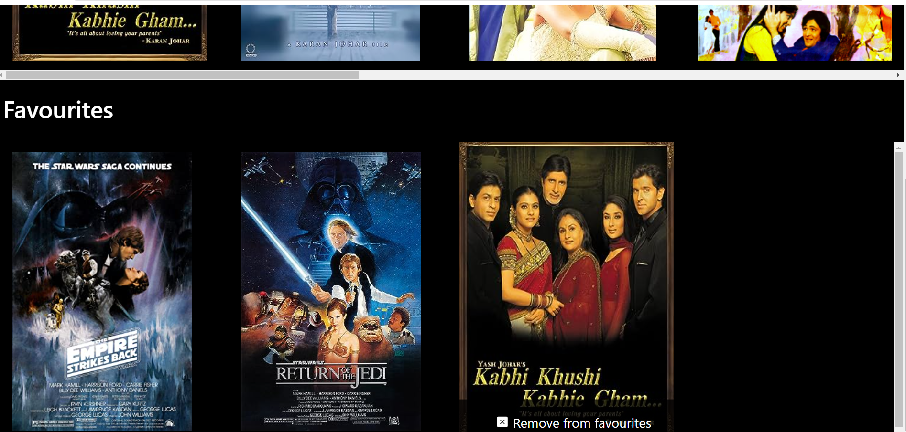

# Movie App

This Movie App is a web application built using the React framework. It leverages the OMDB API to fetch movie data, allowing users to search for movies, add them to their favorites list, and remove them from their favorites.

## Features

- **Search Movies**: Users can search for movies by entering a keyword in the search box. The app fetches movie data from the OMDB API and displays relevant results.

- **Add to Favorites**: Users can add movies to their favorites list by clicking on the "Add to Favorites" button displayed with each movie.

- **Remove from Favorites**: Movies in the favorites list can be removed by clicking on the "Remove from Favorites" button.

## Technologies Used

- **React**: The frontend of the application is built using the React JavaScript library, providing a dynamic and responsive user interface.

- **OMDB API**: The Open Movie Database (OMDB) API is used to fetch movie information, including titles, posters, and ratings.

## Preview




## Getting started

1. Clone the repository to your local machine:

    ```
    git clone https://github.com/your-username/movie-app.git
    ```

2. Navigate to the project directory:

    ```
    cd movie-app
    ```

3. Install dependencies:

    ```
    npm install
    ```

4. Start the development server:

    ```
    npm start
    ```

5. Open your web browser and visit `http://localhost:3000` to view the Movie App.


